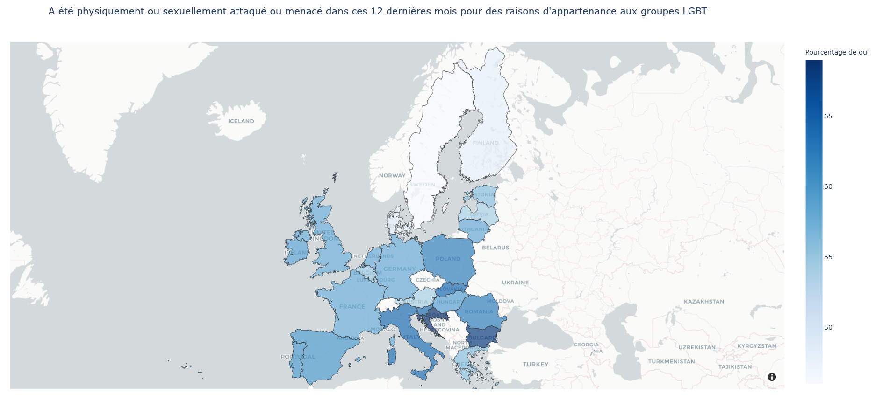
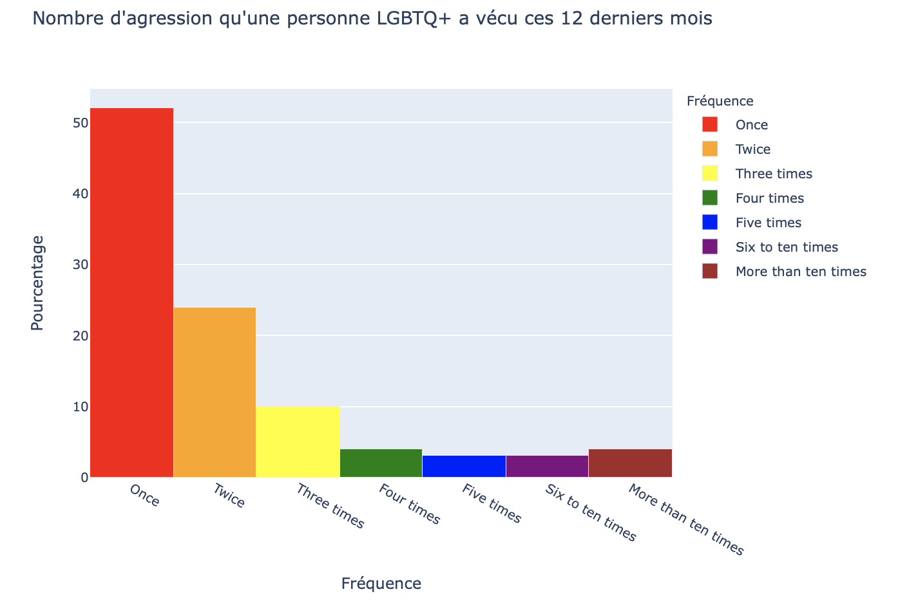
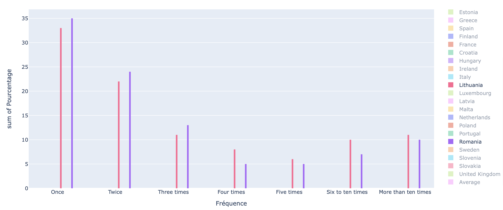
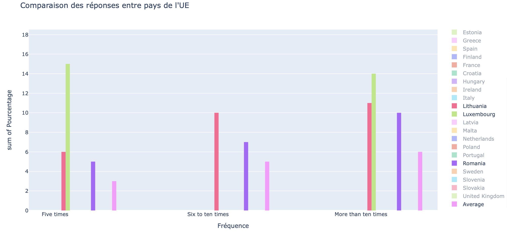

# Python Dashboard : ENDANGERED RAINBOW

## Sommaire

1. [Rapport d'analyse](#rapport-d'analyse)
2. [User Guide](#user-guide)
3. [Developer Guide](#developer-guide)

Trouvez toutes les données et sondages via ce lien :

[Open Data : FRA EU LGBT](https://fra.europa.eu/en/publications-and-resources/data-and-maps/survey-fundamental-rights-lesbian-gay-bisexual-and)

> Notes : Les deux sondages utilisés sont _"How many times did somebody physically/sexually attack or threaten you in the last 12 months ?"_ et _"LAST incident of physical / sexual attack or threat of violence in the past 12 months - Happened because perceived to be L, G, B or T?"_ ; disponibles via le Topic _"Violence and harassment (47)"_.

---

# Rapport d'analyse

### Introduction

Actuellement, la place et la perception des personnes homosexuelles, transgenres, bisexuelles, etc., ne sont pas égalitaires partout dans le monde. Notamment dans l'Union Européenne, cette communauté a été soumise à de nombreuses discriminations, violences et persécutions. La communauté LGBTQ+ (Lesbian, Gay, Bisexual, Transgender, Queer, etc.) se combat dans le monde depuis le début du XXe siècle, pour aboutir à une égalité. Plusieurs mouvements et organisations ont vu le jour afin de faire place à la reconnaissance des droits des personnes LGBTQ+.

Afin de comprendre les réalités de la communauté LGBTQ+, un dashboard a été conçu pour mettre en avant la qualité de vie que peuvent avoir ces personnes en fonction des pays de l'Union Européenne. Ce dashboard comprend une carte de l'UE (Union Européenne) montrant le pourcentage des violences physiques ou sexuelles visant les personnes LGBTQ+; ainsi que trois histogrammes sur le nombre de ces violences durant ces 12 derniers mois des pays de l'UE. En parcourant ce dashboard, nous nous demanderons :  
**Quels sont les pays et à quelle fréquence la communauté LGBTQ+ est le plus agressée physiquement ou verbalement ?**

Nous analyserons d'abord les pays les plus touchées par des agressions grâce à la carte interactive, montrant l'ensemble de l'UE et des résultats du sondage des personnes LGBTQ+; Puis, nous verrons le nombre de fois où une personne LGBTQ+ a été menacé, ou agressé physiquement/sexuellement au cours de ces 12 derniers mois, dans l'UE.

## 1 - Les pays de l'UE les plus touchés

En moyenne en Europe, 59% des personnes de communautés LGBT se sont fait agressé dans les 12 derniers mois pour des raisons d'appartenance à ces communautés. En effet, le chiffre le plus bas est 46% en Suède et cela monte jusqu'à 69% en Croatie. En France, se sont 58% des personnes qui pensent s'être fait agressé pour être perçu comme LGBT.

On remarque ainsi une légère augmentation de ces chiffres pour les pays se situant dans l'Europe de l'est-sud



## 2 - Fréquence d'agression visant une personne LGBTQ+

En se basant des chiffres de la première carte, on peut en déduire que parmis les 58% touchés en France, 52% d'entre eux on été agressé exactement une fois et 14% au moins quatre fois. Cela représente un taux plutot faible par rapport à d'autres pays.

En effet, en exploitant le deuxième et le troisième histogramme, on peut voir que les pays où le taux d'harcèlement est le plus élevé sont la Roumanie, la Lituanie et le Luxembourg. Le pourcentage des fréquences s'équilibrent pour chacun des pays et les pourcentages des nombres d'agressions allant de 5 à plus de dix fois sont 2, voire 3 fois plus élevé que la plupart des pays. Au contraire, si nous prenons seulement la réponse 'Once', donc une seule agression en 12 mois, on peut se dire que les taux sont très faibles (35% pour la Roumanie et 33% pour la Lituanie), comparés à la moyenne qui est de 45%. 



Ainsi, par exemple au Luxembourg, parmis les 55% victimes d'agressions, il y un 44% qui sont agressé une fois mais 42% agressé plus de quatre fois.


### Conclusion

Ce dashboard nous a permis de découvrir les pays les plus touchés par les agressions visant la communauté LGBTQ+ ainsi que le nombre de fois où ces personnes ont été agressé dans les pays de l'UE. En effet, les pays les plus touchés sont : Croatie, Bulgarie, Roumanie. En Bulgarie par exemple : 68 % des individus se sont fait attaqué pour s'être fait perçu comme LGBT et près de 11% d'entre eux se sont fait agressé plus de 10 fois. 

En parcourant ces données et en les analysant, on peut alors se demander si ces données reflètent de la qualité de vie des personnes LGBTQ+ dans ces pays, ou au minima, si elles sont un facteur qui reflèterait de la qualité de vie de la communauté. De plus, il serait intéressant d'établir une corrélation entre la qualité de vie d'une personne LGBTQ+ et les droits qu'elles possèdent dans son pays.

---

# User Guide

Bienvenue dans le guide de l'utilisateur de **Endangered Rainbow** !

Ce guide de l'utilisateur est conçu pour fournir de la documentation aux personnes qui utiliseront le dashboard **Endangered Rainbow**, il est donc conçu pour être lu par tout utilisateur du dashboard.

## 1 - Installation

Plusieurs installations sont nécessaires afin de procéder à l'affichage du dashboard.

### Installation du projet

Une fois invité dans le projet, l'installation se fait à l'aide de la commande suivante :

```
git clone https://github.com/LeoPanEsiee/PythonProject.git
```

### Installation des packages nécessaires

Si vous n'avez pas pip (package manager pour python) :
```
apt install python3-pip
```

Voici la liste des packages à installer :

```
pip3 install dash
pip3 install pandas
```

## 2 - Lancer le dashboard

**URL du dashboard : [Cliquer ici pour accéder au dashboard](http://127.0.0.1:8888)**

### Exécution du code

L'exécution du code pour lancer le dashboard se fait de cette manière :

`python main.py` pour Windows ou `python3 main.py` pour Linux

Cette application est lancée dans une console :

```
$ python main.py
Dash is running on http://127.0.0.1:8888/

* Serving Flask app "main" (lazy loading)
* Environment: production
  WARNING: This is a development server. Do not use it in a production deployment.
  Use a production WSGI server instead.
* Debug mode: off
* Running on http://127.0.0.1:8888/ (Press CTRL+C to quit)
```

Le résultat s’observe dans la fenêtre d’un navigateur à l’adresse indiquée : `http://127.0.0.1:8888`.

## 3 - Explorer la carte interactive

Afin de mieux représenter des réponses, nous avons ajouté au dashboard une carte intéractive.
Celle-ci est accessible dans le menu déroulant principal en sélectionnant `"Carte de pourcentage de personnes agressées par pays"`.

La carte affiche le pourcentage des populations des pays européens ayant répondu "oui" à la question suivante :
`"Votre dernière agression physique ou sexuelle est-elle due au fait vous étiez perçu comme LGBT ?(durant les 12 derniers mois)"`

Les pays les plus foncés sont ceux ayant répondu le plus souvent _"Oui"_. Il est également possible de survoler les pays afin d'avoir le nom du pays ainsi que son pourcentage exact.

Cette carte est manipulable. Il est possible de zoomer et dézoomer avec la molette de la souris et l'on peut également déplacer le champs de vision du monde avec le clic gauche.

## 4 - Découvrir les histogrammes interactifs

Le dashboard contient au total 3 histogrammes. Chaque histogramme a sa propre utilisation et fonctionnalités mais ces histogrammes ont quelques fonctionnalités communes. Pour accéder aux histogrammes, il faut choisir dans le menu déroulant `"Fréquence d'agressions par pays"`ou `"Comparaison des réponses de fréquence d\'agressions"`.

#### Histogramme 1

Cet histogramme a pour but de montrer en détail, le taux d'agression selon un pays choisi. Le choix du pays se fait à l'aide de la sélection en cliquant sur le menu déroulant (dropdown). Le pays par défaut est la France. En cliquant sur un pays, un histogramme s'affiche. En passant la souris sur une des réponses _'Once'_, _'Twice'_, etc., on a le détail du pourcentage d'agression sur cette réponse.

#### Histogramme 2

Cet histogramme a pour but de voir l'ensemble des taux en fonction du pays de l'UE, et cela, en quelques secondes. L'animation permet un aperçu rapide des réponses. Cet histogramme n'a pas pour but d'entrer dans les détails. Pour cela, il faut se référer à l'histogramme 1. Le bouton Play est situé en bas à gauche du graphe, et permet de jouer l'animation. Le bouton Pause peut être activé pendant l'animation et permet d'arrêter l'animation afin de voir les réponses d'un pays. Ce bouton est situé à droite du bouton Play.

#### Histogramme 3

Cet histogramme a pour but de voir la globalité des réponses de chaque pays. Il peut être exploité de plusieurs manières. Par exemple, on peut chercher le taux le plus élevé en cherchant la barre la plus haute, et vice versa. De plus, nous pouvons l'utiliser pour comparer plusieurs pays ciblés, ce qui est utile quand on a un nombre de pays à comparer qui peut varier.

##### Sélectionner un ou plusieurs pays

Pour pouvoir sélectionner un ou plusieurs pays, il faut :

- Double-cliquer sur le pays en question, dans la barre `CountryCode` à droite du graphe,
- Après cette première sélection, on peut ajouter un pays, pour cela :
  - Cliquer une fois sur le deuxième pays choisi
  - Réitérer l'étape pour pouvoir en sélectionner un troisième, et ainsi de suite.

##### Désélectionner un pays

Pour pouvoir retirer un pays de la sélection totale, procéder ainsi :

- Cliquer une fois sur le pays à retirer, dans la barre `CountryCode`, à droite du graphe,
- Réitérer l'étape pour pouvoir en retirer d'autres.

##### Zoomer sur les catégories

Pour pouvoir zoomer sur les catégories de réponses des pays, procéder ainsi :

- Passer la souris en haut à droite du graphe pour afficher le `modebar`,
- Une fois le modebar violet apparu, cliquer sur `Box Select` (logo carré en pointillé),
- Sélectionner les catégories :
  - Cliquer enfoncé en prenant la zone des catégories voulues
  - Relaché le clic lorsque la zone a été choisie.
- Réitérer toutes les étapes ci-dessus pour zoomer davantage

> Notes : Pour revenir sur le mode d'origine, cliquer sur _Autoscale_ du modebar (logo flèches croisées en diagonale).

##### Fonctionnalités Plotly

L'application offre également toutes les fonctionnalités des menus de plotly. Il est donc possible de prendre des captures des zones séléctionnés, de sélectionner avec un mode rectangle ou lasso et de remmetre le graphe par défaut.

---

# Developer Guide

Bienvenue dans le guide du développeur de **Endangered Rainbow** !

Ce guide du développeur est conçu pour fournir de la documentation aux personnes qui souhaiteront développer et approfondir les fonctionnalités du dashboard **Endangered Rainbow**, il est donc conçu pour être lu par tout développeur du dashboard.

## 1 - Programmer et améliorer la carte interactive

La carte se base sur les technologies de **choropleth_mapbox** de **plotly express**.

Pour fonctionner, il faut associer les données que l'on récupère d'un geojson européen; avec les réponses des pays touchés dans le sondage récupéré sous forme de csv.

Il faut en outre prendre en compte les noms donnés à ces pays. Pour cette raison, si un pays du sondage n'est pas présent dans les données du geojson, son cas doit être géré.

Cela concerne en particulier des lignes qui pourraient apparaitrent dans certaines versions de ce sondage (pas présent ici), en particulier pour les chiffres sur la Serbie (pas dans l'UE) et EU-28 qui englobent la moyenne des 28 pays de l'UE. Il y a également le cas particulier de la république Tchèque qui est nommée 'Czechia' dans le csv mais 'Czech Rep.' dans le geojson.

Ainsi, par mesure de sécurité, de simplicité et de gestion d'exceptions, les pays invalides ne sont pas représentés sur la carte.

La carte affiche ensuite les chiffres contenus dans le csv sur les locations des pays concernés. Ici, on affiche le pourcentage des populations ayant répondu _"Oui"_ de chaque pays.

#### Modifier la map

- `mapbox_style="carto-positron"` : changer le fond de la carte. D'autres fonds sont disponibles sur le site de plotly

- `hover_data={'percentage': True, 'id': False}` : en hover sur les pays, on affiche le pourcentage et on enlève l'id du pays qui n'est pas pertinent pour nos chiffres

- `center={'lat': 56.7, 'lon': 10}` : Pour positionner l'emplacement de la carte dans le monde

- `opacity=0.7` : opacité des informations couvrant la carte


## 2 - Améliorer les histogrammes

À partir de la **Partie Graphes**, pour modifier les histogrammes, il est possible de créer des sous ensembles de données en utilisant la méthode _query()_. La représentation des données peut alors être modifiée.

La technologie utilisée est principalement plotly express. Initialement, les histogrammes présentent les catégories (axe x), en fonction des réponses (fréquence d'agression) et l'axe des y en fonction du pourcentage. Cependant, cette catégorisation peut être modifiée. Il suffit de mettre dans le paramètre `x`et/ou `y`, la colonne que l'on veut.

#### Modifier le bargroup

Pour modifier le bargroup (représentation du regroupement des barres), il y a trois possibilités :

- `stack` : `barmode= "stack"` : les valeurs sont empilées les unes sur les autres,
- `group`: `barmode= "group"`: montre l'histogramme sous forme de diagramme à barres groupées,
- `overlay` : `barmode= "overlay"` : affiche les barres semi-transparentes les unes sur les autres.

#### Augmenter ou diminuer le nombre de barres

Utiliser le paramètre `nbins= 5`

#### Agréger les valeurs de manières différentes

L'histogramme de Plotly permet d'agréger les valeurs à l'aide de 5 fonctions - comptage, somme, moyenne, minimum, maximum.

- Utiliser le paramètre `histfunc= "sum"`
  - `count`, `sum`, `avg`, `min`, `max`.

#### Afficher les catégories séparément en ligne ou colonnes

Pour afficher les catégories séparément les unes à côté des autres dans les colonnes ou les unes au-dessus des autres dans les lignes, il faut utiliser les paramètres `facet_col` et `facet_row` qui sont destinés à cet effet.

Exemple :

```
px.histogram(dataf, x="answer",
  color="CountryCode",
  facet_col="CountryCode",
  facet_col_wrap=3)
```

#### Orientation des paramètres

L'histogramme peut être orienté horizontalement ou verticalement. Le paramètre d'orientation a deux valeurs `v` et `h` mais l'orientation est plutôt influencée par `x` et `y`. En inversant l'ordre de x et y, on fait pivoter l'histogramme horizontal verticalement.

Exemple : `px.histogram(dataf, y="answer")`
