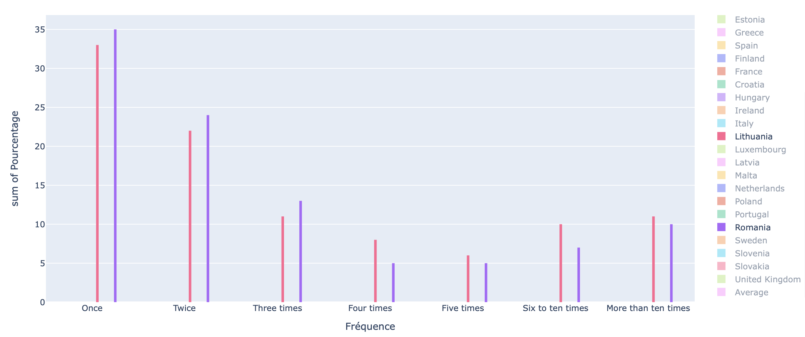

# Python Dashboard : RAINBOW

## Sommaire

1. [Rapport d'analyse](#rapport-d'analyse)
2. [User Guide](#user-guide)
3. [Developper Guide](#developper-guide)
4. [Problèmes rencontrés](#problèmes-rencontrés)

Trouvez toutes les données et sondages via ce lien :

[Open Data : FRA EU LGBT](https://fra.europa.eu/en/publications-and-resources/data-and-maps/survey-fundamental-rights-lesbian-gay-bisexual-and)

> Notes : Les deux sondages utilisés sont _"How many times did somebody physically/sexually attack or threaten you in the last 12 months ?"_ et _"Physically/sexually attacked or threatened with violence at home or elsewhere in the last 5 years for any reason"_ ; disponibles via le Topic _"Violence and harassment (47)"_.

---

# Rapport d'analyse

### Introduction

Actuellement, la place et la perception des personnes homosexuelles, transgenres, bisexuelles, etc., ne sont pas égalitaires partout dans le monde. Notamment dans l'Union Européenne, cette communauté a été soumise à de nombreuses discriminations, violences et persécutions. La communauté LGBTQ+ (Lesbian, Gay, Transgender, Queer, etc.) se combat dans le monde depuis le début du XXe siècle, pour aboutir à une égalité. Plusieurs mouvements et organisations ont vu le jour afin de faire place à la reconnaissance des droits des personnes LGBTQ+.

&nbsp;
Afin de comprendre les réalités de la communauté LGBTQ+, un dashboard a été conçu pour mettre en avant la qualité de vie que peuvent avoir ces personnes en fonction des pays de l'Union Européenne. Ce dashboard comprend une carte de l'UE (Union Européenne) montrant le pourcentage des violences physiques ou sexuelles visant les personnes LGBTQ+ durant ces 5 dernières années ainsi que trois histogrammes du nombre plus ou moins exacts des violences durant ces 12 derniers mois des pays de l'UE. En parcourant ce dashboard, nous nous demanderons :
**quels sont les pays et à quelle fréquence la communauté LGBTQ+ est le plus agressée physiquement ou verbalement ?**

&nbsp;
Premièrement, nous analyserons les pays les plus touchées par des agressions grâce à la carte interactive, montrant l'ensemble de l'UE
et des résultats du sondage des personnes LGBTQ+. Deuxièmement, nous verrons le nombre de fois où une personne LGBTQ+ a été menacé, ou agressé physiquement/sexuellement au cours de ces 12 derniers mois, dans l'UE.

## 1 - Les pays de l'UE les plus touchés

Partie de Léo

- on effectue la division entière de `p` par `d`

  $ python ex03.py
  731 = 17 x 43 : False
  $ python ex03.py
  733 : True

- POUR chaque diviseur `d` parmi les valeurs `2` et les valeurs impaires inférieures à $`\sqrt{p}`$ (vérifier que ça suffit sur un exemple)
  - on effectue la division entière de `p` par `d`
  - SI le reste est nul, ALORS le nombre n’est pas premier et on interrompt le parcours de la boucle en affichant False
- FIN POUR

## 2 - Fréquence d'agression visant une personne LGBTQ+

En France, selon le premier histogramme, il y a un peu plus d'une chance sur deux qu'une personne LGBTQ+ se fasse agressée physiquement ou verbalement contre 3 à 4 % pour une fréquence allant de 4 à plus de dix fois. Les taux d'harcèlement quotidien est donc très bas comparé à une agression éventuelle.

&nbsp;
En exploitant le deuxième et le dernier histogramme, on peut voir que les pays où le taux d'harcèlement est le plus élevé sont la Roumanie, la Lituanie et le Luxembourg. En effet, le pourcentage des fréquences s'équilibrent pour chacun des pays et les pourcentages des nombres d'agressions allant de 5 à plus de dix fois sont 2, voire 3 fois plus élevé que la plupart des pays.

Nous avons un taux de 14% pour les agressions au Luxembourg de plus de dix fois (et 10%, 11% pour la Roumanie et la Lituanie), alors que la moyenne affiche un taux de 6% pour cette même catégorie (cf. _Average_). Ce qui prouve un taux d'harcèlement plus élevé pour ces trois pays.

### Conclusion

Ce dashboard nous a permis de découvrir les pays les plus touchés par les agressions visant la communauté LGBTQ+ ainsi que le nombre de fois où ces personnes ont été agressé dans les pays de l'UE. En effet, les pays les plus touchés sont : , , , ; où on peut apercevoir un pourcentage de %, pour le pays , ou encore un pourcentage de % pour le pays, avec un taux de % d'au moins une agression pour ce même pays.

&nbsp;
En parcourant ces données et en les analysant, on peut alors se demander si ces données reflètent de la qualité de vie des personnes LGBTQ+ dans ces pays, ou au minima, si elles sont un facteur qui reflèterait de la qualité de vie de la communauté. De plus, il serait intéressant d'établir une corrélation entre la qualité de vie d'une personne LGBTQ+ et les droits qu'elles possèdent dans son pays.

---

# User Guide

Bienvenue dans le guide de l'utilisateur de **Rainbow** !

&nbsp;
Ce guide de l'utilisateur est conçu pour fournir de la documentation aux personnes qui utiliseront le dashboard **Rainbow**, il est donc conçu pour être lu par tout utilisateur du dashboard.

## 1 - Explorer la carte interactive

Partie de Léo

"Lorem ipsum dolor sit amet, consectetur adipiscing elit, sed do eiusmod tempor incididunt ut labore et dolore magna aliqua. Ut enim ad

## 2 - Découvrir les histogrammes interactifs

"Lorem ipsum dolor sit amet, consectetur adipiscing elit, sed do eiusmod tempor incididunt ut labore et dolore magna aliqua. Ut enim ad

---

# Developper Guide

Bienvenue dans le guide du développeur de **Rainbow** !

&nbsp;
Ce guide du développeur est conçu pour fournir de la documentation aux personnes qui souhaiteront développer et approfondir les fonctionnalités du dashboard **Rainbow**, il est donc conçu pour être lu par tout développeur du dashboard.

## 1 - Programmer et améliorer la carte interactive

Partie de Léo

`"Lorem ipsum dolor sit amet, consectetur adipiscing elit, sed do eiusmod tempor incididunt ut labore et dolore magna aliqua. Ut enim ad `

## 2 - Apporter sa touche de programmation aux histogrammes interactifs

`"Lorem ipsum dolor sit amet, consectetur adipiscing elit, sed do eiusmod tempor incididunt ut labore et dolore magna aliqua. Ut enim ad `

---

# Problèmes rencontrés

Cette partie traite des problèmes rencontrés notamment lors de la programmation du dashboard mais elle n'exclut pas l'éventualité de problèmes différents rencontrés.
